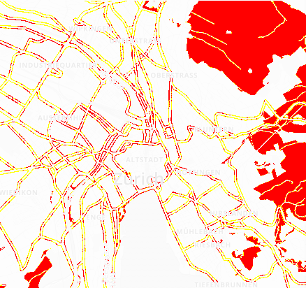
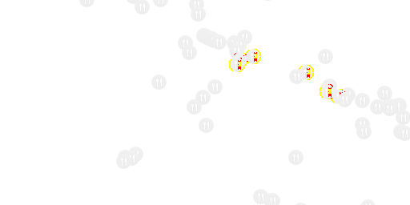
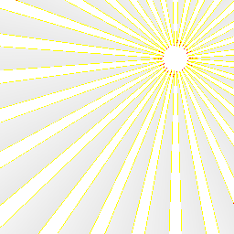

# pixelmatch

[](https://github.com/jacquesg/pixelmatch/actions/workflows/node.yml)
[](https://github.com/jacquesg/pixelmatch/actions/workflows/build.yml)

A pixel-level image comparison library with accurate **anti-aliased pixel detection**
and **perceptual colour difference metrics**. Originally designed for comparing
screenshots in tests.

This is a TypeScript/Rust rewrite of [mapbox/pixelmatch](https://github.com/mapbox/pixelmatch),
with multiple backend options for different environments and performance requirements.

## Features

- **TypeScript** — fully typed, ships its own declarations
- **Native backend** — Rust-based napi-rs binding for significantly faster comparisons
- **WASM backend** — for browser and edge runtime environments
- **Improved anti-aliasing detection** — two-pass approach and relaxed
  sibling check for thin strokes, text, and small features
  (ref: [mapbox/pixelmatch#74](https://github.com/mapbox/pixelmatch/issues/74))

## Installation

```bash
pnpm add @jacquesg/pixelmatch
```

The native binding is distributed as optional platform-specific packages that
install automatically:

| Platform          | Package                                |
| ----------------- | -------------------------------------- |
| macOS arm64       | `@jacquesg/pixelmatch-darwin-arm64`    |
| macOS x64         | `@jacquesg/pixelmatch-darwin-x64`      |
| Linux x64 (glibc) | `@jacquesg/pixelmatch-linux-x64-gnu`   |
| Linux x64 (musl)  | `@jacquesg/pixelmatch-linux-x64-musl`  |
| Linux arm64       | `@jacquesg/pixelmatch-linux-arm64-gnu` |
| Windows x64       | `@jacquesg/pixelmatch-win32-x64-msvc`  |

If the native binding is unavailable for your platform, the JS fallback is
used automatically.

## Backends

| Backend                   | Entry point                      | Environment             | Speed    |
| ------------------------- | -------------------------------- | ----------------------- | -------- |
| **Native** (Rust/napi-rs) | `@jacquesg/pixelmatch` (Node.js) | Node.js                 | Fastest  |
| **JS fallback**           | `@jacquesg/pixelmatch/fallback`  | Node.js, browsers       | Baseline |
| **WASM**                  | `@jacquesg/pixelmatch/wasm`      | Browsers, edge runtimes | Fast     |

The default entry point (`@jacquesg/pixelmatch`) automatically loads the native
binding when available and falls back to the pure JS implementation. You can
check which backend is active via the `_backend` property:

```ts
import pixelmatch from '@jacquesg/pixelmatch';

console.log(pixelmatch._backend); // 'native' or 'js'
```

## Example output

| expected                  | actual                    | diff                         |
| ------------------------- | ------------------------- | ---------------------------- |
|  |  |  |
|  |  |  |
|  |  |  |

## API

### `pixelmatch(img1, img2, output, width, height[, options])`

Compares two images pixel by pixel and returns the number of mismatched pixels.

- **`img1`**, **`img2`** — Image data of the images to compare (`Uint8Array` or `Uint8ClampedArray`).
  Must have equal dimensions.
- **`output`** — Image data to write the diff to, or `null` if you don't need
  a diff image.
- **`width`**, **`height`** — Width and height of the images. All three images
  must share the same dimensions.

**`options`**:

| Option         | Type        | Default         | Description                                                                                              |
| -------------- | ----------- | --------------- | -------------------------------------------------------------------------------------------------------- |
| `threshold`    | `number`    | `0.1`           | Matching threshold (`0` to `1`). Smaller values make the comparison more sensitive.                      |
| `includeAA`    | `boolean`   | `false`         | If `true`, disables detecting and ignoring anti-aliased pixels.                                          |
| `alpha`        | `number`    | `0.1`           | Blending factor of unchanged pixels in the diff output. `0` for pure white, `1` for original brightness. |
| `aaColor`      | `[R, G, B]` | `[255, 255, 0]` | Colour of anti-aliased pixels in the diff output.                                                        |
| `diffColor`    | `[R, G, B]` | `[255, 0, 0]`   | Colour of differing pixels in the diff output.                                                           |
| `diffColorAlt` | `[R, G, B]` | `null`          | Alternative colour for dark-on-light differences. If not set, all differing pixels use `diffColor`.      |
| `diffMask`     | `boolean`   | `false`         | Draw the diff over a transparent background (a mask), rather than over the original image.               |

## Usage

### Node.js

```ts
import fs from 'node:fs';
import { PNG } from 'pngjs';
import pixelmatch from '@jacquesg/pixelmatch';

const img1 = PNG.sync.read(fs.readFileSync('img1.png'));
const img2 = PNG.sync.read(fs.readFileSync('img2.png'));
const { width, height } = img1;
const diff = new PNG({ width, height });

pixelmatch(img1.data, img2.data, diff.data, width, height, { threshold: 0.1 });

fs.writeFileSync('diff.png', PNG.sync.write(diff));
```

### Pure JS fallback (Node.js or browsers)

```ts
import pixelmatch from '@jacquesg/pixelmatch/fallback';

const numDiffPixels = pixelmatch(img1, img2, diff, 800, 600, { threshold: 0.1 });
```

### WASM (browsers / edge runtimes)

```ts
import pixelmatch, { initialize } from '@jacquesg/pixelmatch/wasm';

// Initialise the WASM module (call once)
await initialize();

const numDiffPixels = pixelmatch(img1, img2, diff, 800, 600, { threshold: 0.1 });
```

### Browser (Canvas API)

```ts
import pixelmatch from '@jacquesg/pixelmatch/fallback';

const img1 = img1Context.getImageData(0, 0, width, height);
const img2 = img2Context.getImageData(0, 0, width, height);
const diff = diffContext.createImageData(width, height);

pixelmatch(img1.data, img2.data, diff.data, width, height, { threshold: 0.1 });

diffContext.putImageData(diff, 0, 0);
```

## Command line

```bash
pixelmatch image1.png image2.png [diff.png] [threshold] [includeAA]
```

**Exit codes:**

| Code | Meaning                       |
| ---- | ----------------------------- |
| `0`  | Images are identical          |
| `64` | Invalid arguments             |
| `65` | Image dimensions do not match |
| `66` | Images have differences       |

## Algorithm

This library implements ideas from the following papers:

- [Measuring perceived colour difference using YIQ NTSC transmission colour space in mobile applications](https://www.spiedigitallibrary.org/conference-proceedings-of-spie/8011/80119D/Simple-perceptual-color-space-for-color-specification-and-real-time/10.1117/12.901997.full) (2010, Yuriy Kotsarenko, Fernando Ramos)
- [Anti-aliased pixel and intensity slope detector](https://www.researchgate.net/publication/234126755_Anti-aliased_Pixel_and_Intensity_Slope_Detector) (2009, Vytautas Vyšniauskas)

### Anti-aliasing detection improvements

This implementation includes two changes to the anti-aliasing detection
algorithm to improve accuracy for thin strokes, text, and small features:

1. **Two-pass approach** — The original algorithm only checks `hasManySiblings`
   on the last neighbour found with the min/max delta, missing tied candidates.
   This made results depend on loop iteration order. We now find min/max in
   pass 1, then check all matching neighbours in pass 2.

2. **Relaxed sibling check** — Changed from requiring `hasManySiblings` in
   both images to requiring it in either image. For 1px-wide strokes, the
   stroke-side extreme never has 3+ identical siblings because the feature is
   too narrow. Requiring siblings in just one image is sufficient — the
   gradient requirement already confirms we are at an edge.

## Attribution

This project is a TypeScript/Rust rewrite based on [mapbox/pixelmatch](https://github.com/mapbox/pixelmatch)
by [Mapbox](https://www.mapbox.com/). The original JavaScript implementation,
algorithm design, and test fixtures are from that project.

## Licence

ISC © [Mapbox](https://www.mapbox.com/) (original implementation), [Jacques Germishuys](https://github.com/jacquesg) (this fork)
